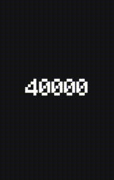

<div align="center">

# Tetris Clone

</div>

## About
Welcome to my Tetris clone project! This is a simple implementation of the classic Tetris game built using SDL.

## Showcase

<div align="center">
  </img>
</div>

## TOC
- [About](#about)
- [Showcase](#showcase)
- [TOC](#toc)
- [Installation](#installation)
- [Controls](#controls)
- [Requirements](#requirements)
- [License](#license)

## Installation
#### 0. Install Tools
You have to install `cmake`, `gcc`, `gcc-toolchain`, `ninja-build`, `vcpkg`.
##### Linux
```bash
sudo apt install build-essential cmake ninja-build
```
##### Windows
For Windows use [`Mingw64`](https://sourceforge.net/mingw-x64) 
```bash
# In MINGW64
pacman -Syu
pacman -S mingw-w64-x86_64-toolchain mingw-w64-x86_64-cmake mingw-w64-x86_64-ninja
gcc --version && g++ --version && gdb --version
```

#### 1. Install Dependencies
##### Linux gcc
```bash
vcpkg install --x-install-root=./vendor
```
##### Windows with mingw64 triplet vcpkg
```bash
vcpkg install -triplet x64-mingw-static -x-install-root=./vendor
```
In project root.

### 2. Compilation via CMake
```bash
cmake -S . -B build -G Ninja && cmake --build build --target Tetris
```
Set your toolchain -DCMAKE_TOOLCHAIN_FILE="$PWD/vendor/vcpkg/scripts/buildsystems/vcpkg.cmake"
Might required providing compiler by `-DCMAKE_C_COMPILER=gcc -DCMAKE_CXX_COMPILER=g++`.  
Build specific target `--target Tetris`.  
Provide path to toolchain `-DCMAKE_TOOLCHAIN_FILE="$PWD/vendor/vcpkg/scripts/buildsystems/vcpkg.cmake"`.

#### 3. Run Program
```bash
./build/output/Tetris
```

#### 4. Compile and run
```bash
cmake -S . -B build -G Ninja -DCMAKE_C_COMPILER=gcc -DCMAKE_CXX_COMPILER=g++ && cmake --build build --target Tetris && ./build/output/Tetris
```

## Controls

- **A Key**: Move the tetromino left.
- **D Key**: Move the tetromino right.
- **S Key**: Accelerate the downward movement of the tetromino.
- **Q Key**: Rotate the tetromino clockwise.
- **E Key**: Hard drop the tetromino.

## Requirements
* cmake
* git
* SDL2 downloaded
* SDL2_ttf downloaded

## License
This project is licensed under the MIT License. See the [LICENSE](LICENSE) file for details.

